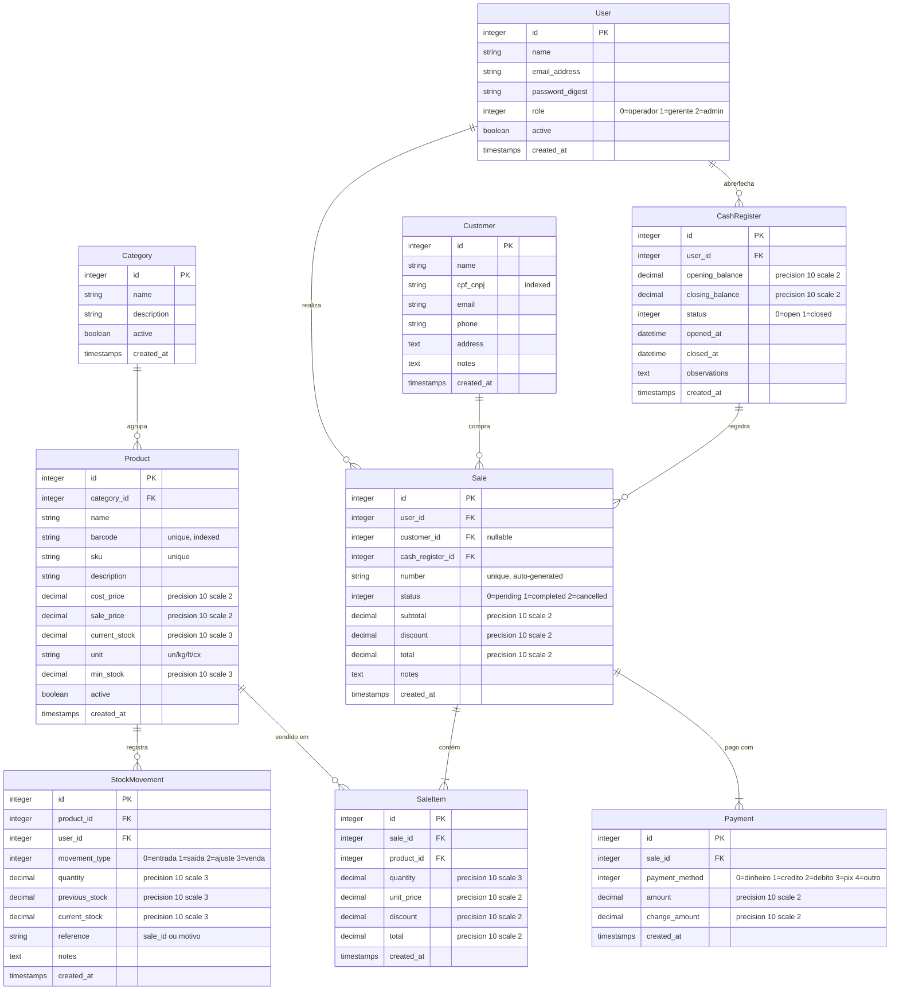

# Sistema PDV (Ponto de Venda)

Um sistema de Ponto de Venda completo para gerenciamento de vendas, produtos, clientes, estoque e controle de caixa. Construído com Rails 8, Hotwire e SQLite, com arquitetura preparada para futura integração fiscal brasileira.

## Stack Definida

| Tecnologia | Escolha | Versão |
|:---|:---|:---|
| **Linguagem** | Ruby | 3.3+ |
| **Framework** | Rails | 8.0+ |
| **Frontend** | Hotwire (Turbo + Stimulus) | Padrão Rails 8 |
| **Banco de Dados** | SQLite | 3.x |
| **Testes** | Minitest | Nativo Rails |
| **CSS** | Tailwind CSS | 4.x (padrão Rails 8) |
| **Autenticação** | Rails built-in auth | 8.0+ |

---

## User Review Required

> [!IMPORTANT]
> **SQLite em Produção**: SQLite é ideal para desenvolvimento e projetos menores. Se o PDV crescer para múltiplas estações ou alto volume de transações simultâneas, será necessário migrar para PostgreSQL. A arquitetura do Rails facilita essa migração no futuro.

> [!IMPORTANT]
> **Integração Fiscal Futura**: A arquitetura será projetada com um módulo `Fiscal` isolado (namespace/engine) para que NFC-e, NF-e e SAT possam ser integrados posteriormente sem refatoração significativa.

---

## Modelo de Dados (Schema)



---

## Proposed Changes

### Fase 0 — Inicialização do Projeto

#### [NEW] Projeto Rails

```bash
rails new . --css=tailwind --skip-jbuilder --database=sqlite3
```

- Gerar o projeto dentro de `/home/thigas/projetos/pdv`
- Configurar autenticação com `bin/rails generate authentication`
- Adicionar campo `role` e `active` ao modelo `User`

---

### Fase 1 — Models & Migrations (Core)

Criar os modelos na seguinte ordem (respeitando dependências de FK):

#### [NEW] `app/models/category.rb`
- Validações: `name` (presence, uniqueness)
- Scope: `active` → `where(active: true)`
- Associação: `has_many :products`

#### [NEW] `app/models/product.rb`
- Validações: `name`, `description`, `barcode` (uniqueness), `sku` (uniqueness), `sale_price`, `unit` (presence)
- Scopes: `active`, `low_stock` → `where("current_stock <= min_stock")`
- Associações: `belongs_to :category`, `has_many :sale_items`, `has_many :stock_movements`
- Enum: `unit` → `{ un: "un", kg: "kg", lt: "lt", cx: "cx" }`
- Callbacks: Nenhum — estoque controlado via `StockMovement`

#### [NEW] `app/models/customer.rb`
- Validações: `name` (presence), `cpf_cnpj` (uniqueness, allow_blank)
- Scopes: busca por nome/cpf
- Associação: `has_many :sales`

#### [NEW] `app/models/cash_register.rb`
- Validações: `opening_balance` (presence), apenas 1 caixa aberto por usuário
- Enum: `status` → `{ open: 0, closed: 1 }`
- Associações: `belongs_to :user`, `has_many :sales`
- Método: `close!(closing_balance)` — calcula diferença, fecha caixa

#### [NEW] `app/models/sale.rb`
- Validações: `number` (uniqueness), `cash_register` must be open
- Enum: `status` → `{ pending: 0, completed: 1, cancelled: 2 }`
- Associações: `belongs_to :user`, `belongs_to :customer` (optional), `belongs_to :cash_register`, `has_many :sale_items`, `has_many :payments`
- Callbacks: `before_create` → gerar `number` sequencial (formato: `VND-YYYYMMDD-XXXX`)
- Método: `complete!` → valida pagamentos, atualiza estoque, muda status
- Método: `cancel!` → estorna estoque, muda status

#### [NEW] `app/models/sale_item.rb`
- Validações: `quantity` (> 0), `unit_price` (>= 0)
- Callbacks: `before_save` → calcula `total = (quantity * unit_price) - discount`
- Associações: `belongs_to :sale`, `belongs_to :product`

#### [NEW] `app/models/payment.rb`
- Enum: `payment_method` → `{ dinheiro: 0, credito: 1, debito: 2, pix: 3, outro: 4 }`
- Validações: `amount` (> 0)
- Associação: `belongs_to :sale`

#### [NEW] `app/models/stock_movement.rb`
- Enum: `movement_type` → `{ entrada: 0, saida: 1, ajuste: 2, venda: 3 }`
- Validações: `quantity` (presence), `movement_type` (presence)
- Associações: `belongs_to :product`, `belongs_to :user`
- Callback: `after_create` → atualiza `product.current_stock`

---

### Fase 2 — Controllers & Views (CRUD)

#### [NEW] `app/controllers/categories_controller.rb`
- CRUD completo com Turbo Frames para edição inline
- Filtro de permissão: apenas gerente/admin

#### [NEW] `app/controllers/products_controller.rb`
- CRUD completo com busca por nome/barcode/sku
- Listagem com indicador visual de estoque baixo
- Import por CSV (fase futura)

#### [NEW] `app/controllers/customers_controller.rb`
- CRUD completo com busca por nome/CPF
- Histórico de compras do cliente

#### [NEW] `app/controllers/cash_registers_controller.rb`
- `open` / `close` actions
- Resumo do caixa: total de vendas, formas de pagamento, diferença

#### [NEW] `app/controllers/sales_controller.rb`
- **Tela principal do PDV** — interface otimizada para velocidade
- Busca de produto por barcode (Stimulus controller para foco automático)
- Adição de itens via Turbo Stream
- Cálculo de totais em tempo real
- Finalização com múltiplas formas de pagamento
- Cancelamento com estorno de estoque

#### [NEW] `app/controllers/stock_movements_controller.rb`
- Registro de entrada/ajuste de estoque
- Histórico de movimentações por produto

#### [NEW] `app/controllers/dashboard_controller.rb`
- Resumo de vendas do dia
- Produtos com estoque baixo
- Últimas vendas

---

### Fase 3 — Interface do Usuário (Views)

#### Layout & Navegação

- **Sidebar** fixa à esquerda com ícones + texto
  - Dashboard, PDV (Venda), Produtos, Categorias, Clientes, Estoque, Caixa
- **Header** com nome do usuário, caixa atual, botão de logout
- **Design**: tema escuro profissional, cores de destaque em verde/azul

#### [NEW] Tela do PDV (Venda) — View Principal

```
┌────────────────────────────────────────────────────────┐
│  🔍 [Campo de busca por barcode/nome]    [Caixa #001] │
├──────────────────────────┬─────────────────────────────┤
│                          │                             │
│   Lista de Itens         │   Resumo da Venda           │
│   ┌──────────────────┐   │   ┌───────────────────┐     │
│   │ Produto | Qtd |$  │   │   │ Subtotal:  R$XX   │     │
│   │ ───────────────── │   │   │ Desconto:  R$XX   │     │
│   │ Item 1  | 2  |10  │   │   │ Total:     R$XX   │     │
│   │ Item 2  | 1  |25  │   │   │                   │     │
│   └──────────────────┘   │   │ [💰 Finalizar]     │     │
│                          │   │ [❌ Cancelar]       │     │
│                          │   └───────────────────┘     │
├──────────────────────────┴─────────────────────────────┤
│  [F2-Buscar] [F3-Cliente] [F5-Desconto] [F12-Fechar]  │
└────────────────────────────────────────────────────────┘
```

- Atalhos de teclado via Stimulus controllers
- Turbo Frames para adição/remoção de itens sem reload
- Modal de pagamento com múltiplas formas

---

### Fase 4 — Stimulus Controllers (JavaScript)

#### [NEW] `app/javascript/controllers/barcode_controller.js`
- Foco automático no campo de barcode
- Busca produto ao pressionar Enter
- Adiciona item à venda via Turbo

#### [NEW] `app/javascript/controllers/keyboard_shortcut_controller.js`
- F2 → Buscar produto
- F3 → Selecionar cliente
- F5 → Aplicar desconto
- F12 → Finalizar venda
- ESC → Cancelar operação

#### [NEW] `app/javascript/controllers/payment_controller.js`
- Calcula troco em tempo real
- Permite dividir pagamento entre métodos
- Validação: soma dos pagamentos >= total da venda

#### [NEW] `app/javascript/controllers/calculator_controller.js`
- Cálculo de totais em tempo real na tela de venda
- Atualiza subtotal, desconto e total

---

### Fase 5 — Preparação para Fiscal (Namespace Isolado)

#### [NEW] `app/models/fiscal/` (namespace)
- Criar módulo `Fiscal` vazio com interface definida
- `Fiscal::Document` — model base para documentos fiscais futuros
- `Fiscal::Emitter` — service object com interface stub

```ruby
# app/services/fiscal/emitter.rb
module Fiscal
  class Emitter
    def self.emit(sale)
      # TODO: implementar integração com NFC-e/NF-e/SAT
      Rails.logger.info "[Fiscal] Emissão fiscal pendente para venda #{sale.number}"
      { status: :not_configured }
    end
  end
end
```

> [!NOTE]
> Este módulo é um **placeholder arquitetural**. A integração real com SEFAZ/SAT será implementada em fase posterior, mas a `Sale#complete!` já chamará `Fiscal::Emitter.emit(self)` para que o ponto de integração esteja definido.

---

## Rotas

```ruby
Rails.application.routes.draw do
  root "dashboard#index"

  resource :session
  resources :passwords, param: :token

  resources :categories
  resources :products do
    resources :stock_movements, only: [:index, :new, :create]
  end
  resources :customers

  resources :cash_registers, only: [:index, :show, :new, :create] do
    member do
      patch :close
    end
  end

  resources :sales do
    resources :sale_items, only: [:create, :update, :destroy]
    resources :payments, only: [:create]
    member do
      patch :complete
      patch :cancel
    end
  end

  # Busca de produtos (AJAX)
  get "products/search", to: "products#search", as: :search_products
end
```

---

## Verificação

### Testes Automatizados (Minitest)

```bash
bin/rails test
```

- **Model tests:** Validações, callbacks, cálculos de totais, movimentação de estoque
- **Controller tests:** CRUD, autorização por role, fluxo de venda completo
- **System tests:** Fluxo de venda de ponta a ponta (buscar produto → adicionar → pagar → concluir)

### Verificação Manual

- Criar produtos e categorias
- Abrir caixa → realizar venda → fechar caixa
- Verificar estoque atualizado após venda
- Verificar cálculos de totais e troco
- Testar atalhos de teclado
- Cancelar venda e verificar estorno de estoque

---

## Ordem de Execução Recomendada

| Fase | Descrição | Dependências |
|:---|:---|:---|
| **0** | Inicializar projeto Rails, configurar auth | Nenhuma |
| **1** | Models & Migrations | Fase 0 |
| **2** | Controllers & CRUD básico | Fase 1 |
| **3** | Views & Interface do PDV | Fase 2 |
| **4** | Stimulus Controllers | Fase 3 |
| **5** | Namespace Fiscal (stub) | Fase 1 |
